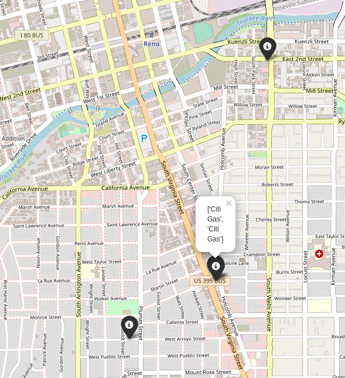

# TRACKALYZER

identify visited points of interest in GPX tracks



## usage

### install

```
python3 -m pip install trackalyzer
```

### run

#### show usage

```
trackalyzer --help

trackalyzer render --help

trackalyzer print --help
```

#### print calculated poi to the console

```
trackalyzer --poi print <gpx>
```

#### generate an html map with full trace

```
trackalyzer render --trace <gpx>
```

#### generate an html map with only poi

```
trackalyzer --poi render <gpx>
```

#### generate an html map with poi and clustered resting points

```
trackalyzer --poi render --cluster <gpx>
```

## development

### prepare

```
python3 -m pip install poetry
```

### build

```
git clone https://github.com/khimaros/trackalyzer

cd trackalyzer

poetry install
```

### run

```
poetry run trackalyzer [args]
```
